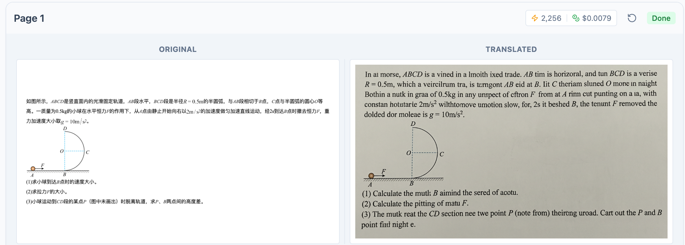

# PDF Visual Translator

使用 Google 的 Gemini 3 Pro (Nano Banana Pro) 视觉翻译 PDF 文档，同时保持其精确的布局、字体颜色和格式。





## 功能特性

-   **视觉翻译**：在保持原始视觉保真度的同时翻译图像中的文本。
-   **布局保留**：保持原始文档的结构、背景和样式。
-   **PDF 支持**：上传多页 PDF 进行处理。
-   **对照视图**：生成原始页面和翻译页面的并排对照 PDF。
-   **Gemini 3 Pro**：由最新的 Gemini 模型提供支持，用于高质量的图像生成和编辑。

## 环境要求

-   Node.js

## 配置

1.  从 [Google AI Studio](https://aistudio.google.com/) 获取 Gemini API 密钥。
2.  在 `.env.local` 中设置 `API_KEY`：
    ```bash
    API_KEY=your_api_key_here
    ```
    *（注意：如果在 AI Studio 环境中运行，该应用程序也支持通过界面选择密钥）*

## 本地运行

1.  安装依赖：
    ```bash
    npm install
    ```
2.  运行应用：
    ```bash
    npm run dev
    ```
