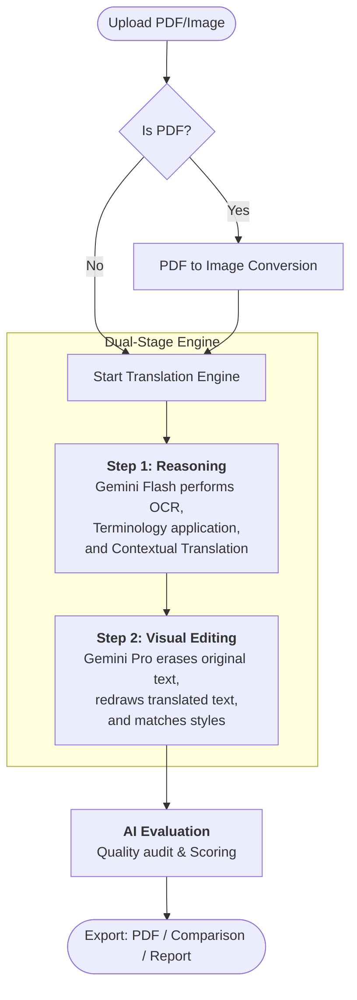
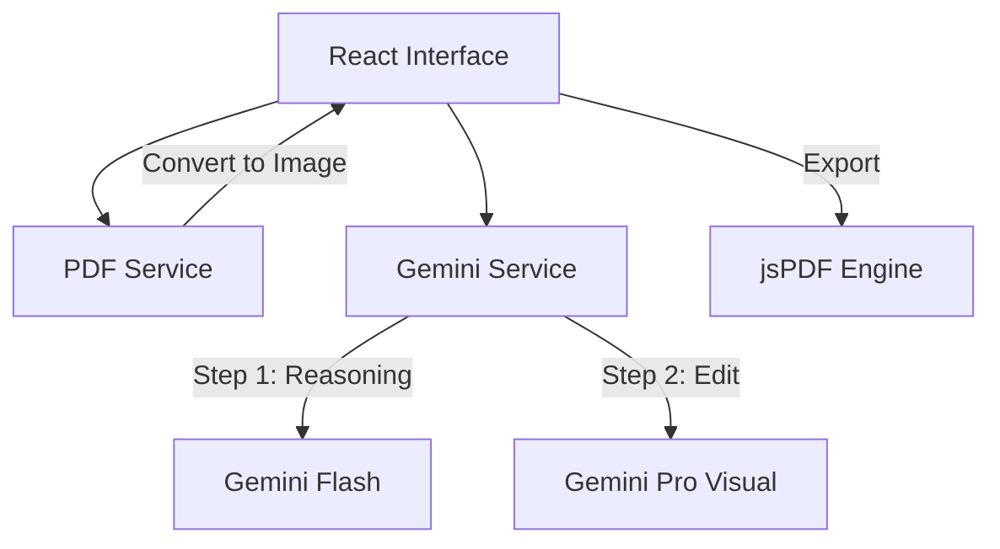

# PDF Visual Translator

An advanced AI-powered document translation tool that leverages Google Gemini models to perform **visual-aware translation**. Unlike traditional OCR tools, this project preserves the exact layout, font styles, colors, and background of the original PDF while overlaying perfectly localized text.

---

## 🚀 Key Features

### 1. Dual-Stage AI Translation Engine
The heart of the application is a sophisticated two-step process:
- **Phase 1 (Extraction & Reasoning):** Uses Gemini Flash to perform high-precision OCR and contextual translation, respecting custom glossaries and linguistic rules.
- **Phase 2 (Visual Reconstruction):** Uses Gemini Pro (Visual Specialist) to erase original text and "redraw" the translated segments using pixel-perfect alignment and style matching.

### 2. Professional Quality Evaluation
- **Automated Audit:** Every translation is automatically evaluated by a secondary AI agent.
- **Detailed Metrics:** Scores across Accuracy, Fluency, Consistency, Terminology, Completeness, and Format Preservation.
- **Optimization Suggestions:** Context-aware feedback provided for every page to ensure professional-grade output.

### 3. Advanced Linguistic Controls
- **Bilingual Preservation:** Smartly keeps English headers, technical terms, and product names (e.g., "CONTENTS 目录" becomes "CONTENTS 目錄").
- **Glossary Enforcement:** Upload or paste custom term mappings to ensure industry-specific accuracy.
- **Hong Kong Localization:** Dedicated support for Traditional Chinese (Hong Kong) standards.

### 4. Enterprise Export Options
- **Translated PDF:** High-fidelity document mirroring the original layout.
- **Comparison View:** Side-by-side (Original vs. Translated) PDF for verification.
- **Evaluation Report:** Detailed JPEG/PDF reports containing AI scores and suggestions for each page.

---

## 🛠 Technology Stack

- **Frontend:** React + Vite + Tailwind CSS
- **AI Backend:** Google Gemini API (Pro & Flash)
- **PDF Processing:** PDF.js (Parsing) & jsPDF (Generating)
- **Icons:** Lucide React

---

## 📦 Getting Started

### Prerequisites
- **Node.js** (LTS version recommended)
- **Google AI Studio API Key** (Get it [here](https://aistudio.google.com/))

### Installation
1. Clone the repository:
   ```bash
   git clone <repo-url>
   cd pdf-visual-translator
   ```
2. Install dependencies:
   ```bash
   npm install
   ```
3. Set up environment:
   Create a `.env.local` file or set the environment variable:
   ```bash
   GEMINI_API_KEY=your_api_key_here
   ```

### Running Locally
```bash
npm run dev
```
Open [http://localhost:3000](http://localhost:3000) in your browser.

---

## 🔄 Translation Workflow



---

## 🧬 Project Architecture



---

## 🛡 License
This project is licensed under the MIT License.
